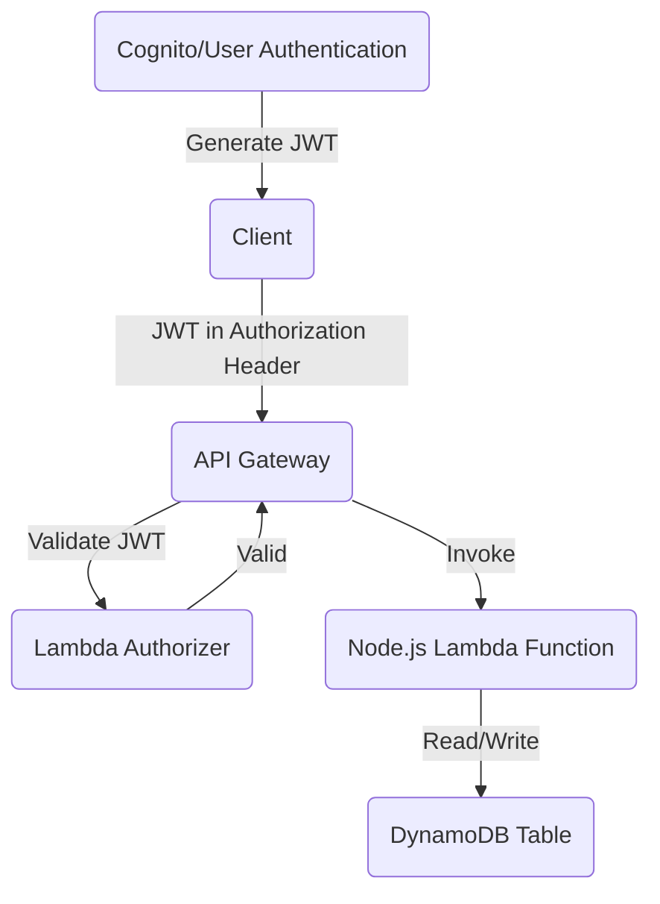

# hello

```mermaid
graph TD
    Client(Client) -->|JWT in Authorization Header| APIGateway(API Gateway)
    APIGateway -->|Validate JWT| Authorizer(Lambda Authorizer)
    Authorizer -->|Valid| APIGateway
    APIGateway -->|Invoke| Lambda(Node.js Lambda Function)
    Lambda -->|Read/Write| DynamoDB(DynamoDB Table)
    Cognito(Cognito/User Authentication) -->|Generate JWT| Client
```     