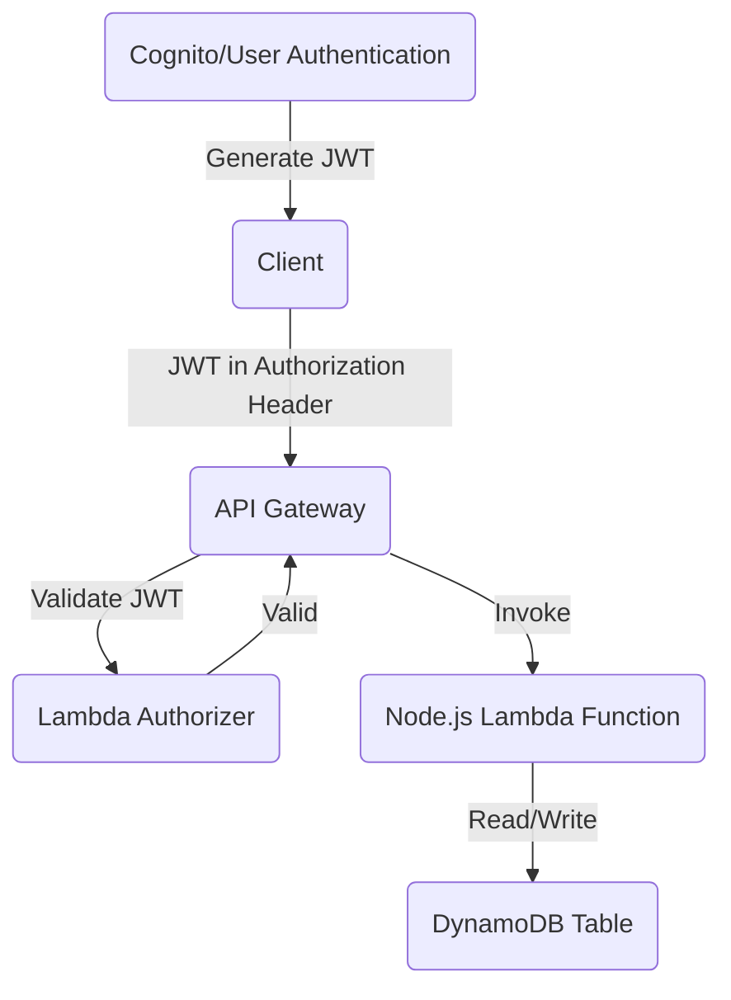

# hello

### Scalable RESTful API Using AWS Lambda, API Gateway, DynamoDB, and JWT Authentication

This architecture describes how to implement a serverless, scalable RESTful API using AWS Lambda (Node.js), API Gateway, DynamoDB, and JWT for user authentication and authorization.

### Architecture Overview

###  Client: 
A user or application that interacts with the RESTful API.

Sends HTTP requests to the API Gateway, including a JWT in the Authorization header for authenticated requests.

### API Gateway:

Exposes the REST API endpoints to the client.

Routes incoming requests to the appropriate Lambda function.

Validates the JWT either through a built-in Cognito Authorizer or a custom Lambda Authorizer.

### Lambda Function:
Processes incoming requests.

Verifies the JWT if not already done by the API Gateway.

Handles business logic and interacts with DynamoDB for data persistence.

### DynamoDB:
A NoSQL database used to store and retrieve application data.

Interacted with by the Lambda function for read/write operations.

### Amazon Cognito (Optional) ( JWT stuff ):
Manages user pools for authentication.
Generates JWTs upon successful user authentication.

#### terraform: 
# Define provider
provider "aws" {
  region = "us-east-1"
}

# Create DynamoDB Table
resource "aws_dynamodb_table" "my_table" {
  name           = "MyDynamoDBTable"
  billing_mode   = "PAY_PER_REQUEST"
  hash_key       = "id"

  attribute {
    name = "id"
    type = "S"
  }

  tags = {
    Name = "MyDynamoDBTable"
  }
}

# Create IAM Role for Lambda
resource "aws_iam_role" "lambda_execution" {
  name = "lambda_execution_role"

  assume_role_policy = jsonencode({
    Version = "2012-10-17",
    Statement = [
      {
        Action    = "sts:AssumeRole",
        Effect    = "Allow",
        Principal = {
          Service = "lambda.amazonaws.com"
        }
      }
    ]
  })
}

# Attach policy to IAM Role
resource "aws_iam_policy_attachment" "lambda_execution_policy" {
  name       = "lambda_execution_policy"
  roles      = [aws_iam_role.lambda_execution.name]
  policy_arn = "arn:aws:iam::aws:policy/service-role/AWSLambdaBasicExecutionRole"
}

# Add DynamoDB permissions to Lambda role
resource "aws_iam_role_policy" "dynamodb_access" {
  name = "dynamodb_access_policy"
  role = aws_iam_role.lambda_execution.id

  policy = jsonencode({
    Version = "2012-10-17",
    Statement = [
      {
        Action   = ["dynamodb:*"],
        Effect   = "Allow",
        Resource = "*"
      }
    ]
  })
}

# Create Lambda Function
resource "aws_lambda_function" "api_function" {
  function_name    = "MyAPILambda"
  runtime          = "nodejs18.x"
  role             = aws_iam_role.lambda_execution.arn
  handler          = "index.handler"
  filename         = "lambda_function.zip"
  source_code_hash = filebase64sha256("lambda_function.zip") # Pre-packaged ZIP file

  environment {
    variables = {
      DYNAMODB_TABLE = aws_dynamodb_table.my_table.name
    }
  }
}

# Create API Gateway
resource "aws_apigatewayv2_api" "api" {
  name          = "MyAPIGateway"
  protocol_type = "HTTP"
}

# Integrate API Gateway with Lambda
resource "aws_apigatewayv2_integration" "lambda_integration" {
  api_id           = aws_apigatewayv2_api.api.id
  integration_type = "AWS_PROXY"
  integration_uri  = aws_lambda_function.api_function.arn
  payload_format_version = "2.0"
}

# Create API Gateway Route
resource "aws_apigatewayv2_route" "route" {
  api_id    = aws_apigatewayv2_api.api.id
  route_key = "ANY /{proxy+}"

  target = "integrations/${aws_apigatewayv2_integration.lambda_integration.id}"
}

# Deploy API Gateway Stage
resource "aws_apigatewayv2_stage" "default" {
  api_id      = aws_apigatewayv2_api.api.id
  name        = "$default"
  auto_deploy = true
}

# Grant API Gateway permission to invoke Lambda
resource "aws_lambda_permission" "api_gateway" {
  statement_id  = "AllowAPIGatewayInvoke"
  action        = "lambda:InvokeFunction"
  function_name = aws_lambda_function.api_function.arn
  principal     = "apigateway.amazonaws.com"

  source_arn = "${aws_apigatewayv2_api.api.execution_arn}/*"
}
## deploy: 
zip lambda_function.zip index.js  
terraform init  
terraform plan  
terraform apply   
