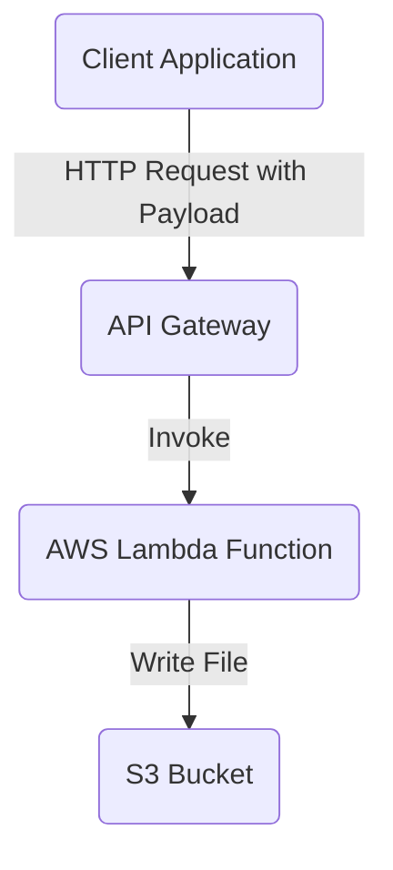

### Explanation of Each Component:
Client (Client Application):

### Sends an HTTP request (e.g., POST /write) with data to be written to the S3 bucket.
API Gateway:

### Receives the HTTP request.
Routes the request to the Lambda function using an AWS_PROXY integration.
Lambda Function:

### Processes the request payload, extracts the file content and key (filename).
Uses the AWS SDK to write the content to the specified S3 bucket.
S3 Bucket:

Stores the uploaded file from Lambda.

### Summary
This configuration sets up a complete system to write to an S3 bucket using an API Gateway, Lambda, and IAM policies. Let me know if you need further explanations or additional features!

# Define provider
provider "aws" {
  region = "us-east-1"
}

# Create S3 Bucket
resource "aws_s3_bucket" "my_bucket" {
  bucket = "my-lambda-s3-bucket"
  acl    = "private"

  tags = {
    Name = "MyLambdaS3Bucket"
  }
}

# Create IAM Role for Lambda
resource "aws_iam_role" "lambda_execution" {
  name = "lambda_execution_role"

  assume_role_policy = jsonencode({
    Version = "2012-10-17",
    Statement = [
      {
        Action    = "sts:AssumeRole",
        Effect    = "Allow",
        Principal = {
          Service = "lambda.amazonaws.com"
        }
      }
    ]
  })
}

# Attach policy to IAM Role
resource "aws_iam_policy_attachment" "lambda_execution_policy" {
  name       = "lambda_execution_policy"
  roles      = [aws_iam_role.lambda_execution.name]
  policy_arn = "arn:aws:iam::aws:policy/service-role/AWSLambdaBasicExecutionRole"
}

# Add S3 permissions to Lambda role
resource "aws_iam_role_policy" "s3_access" {
  name = "s3_access_policy"
  role = aws_iam_role.lambda_execution.id

  policy = jsonencode({
    Version = "2012-10-17",
    Statement = [
      {
        Action   = ["s3:PutObject"],
        Effect   = "Allow",
        Resource = "arn:aws:s3:::my-lambda-s3-bucket/*"
      }
    ]
  })
}

# Create Lambda Function
resource "aws_lambda_function" "s3_writer" {
  function_name    = "WriteToS3Lambda"
  runtime          = "nodejs18.x"
  role             = aws_iam_role.lambda_execution.arn
  handler          = "index.handler"
  filename         = "lambda_function.zip"
  source_code_hash = filebase64sha256("lambda_function.zip") # Pre-packaged ZIP file

  environment {
    variables = {
      BUCKET_NAME = aws_s3_bucket.my_bucket.bucket
    }
  }
}

# Create API Gateway
resource "aws_apigatewayv2_api" "api" {
  name          = "MyS3APIGateway"
  protocol_type = "HTTP"
}

# Integrate API Gateway with Lambda
resource "aws_apigatewayv2_integration" "lambda_integration" {
  api_id           = aws_apigatewayv2_api.api.id
  integration_type = "AWS_PROXY"
  integration_uri  = aws_lambda_function.s3_writer.arn
  payload_format_version = "2.0"
}

# Create API Gateway Route
resource "aws_apigatewayv2_route" "route" {
  api_id    = aws_apigatewayv2_api.api.id
  route_key = "POST /write"

  target = "integrations/${aws_apigatewayv2_integration.lambda_integration.id}"
}

# Deploy API Gateway Stage
resource "aws_apigatewayv2_stage" "default" {
  api_id      = aws_apigatewayv2_api.api.id
  name        = "$default"
  auto_deploy = true
}

# Grant API Gateway permission to invoke Lambda
resource "aws_lambda_permission" "api_gateway" {
  statement_id  = "AllowAPIGatewayInvoke"
  action        = "lambda:InvokeFunction"
  function_name = aws_lambda_function.s3_writer.arn
  principal     = "apigateway.amazonaws.com"

  source_arn = "${aws_apigatewayv2_api.api.execution_arn}/*"
}
